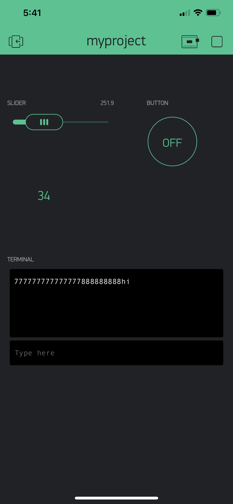

Name:

EID:

Team Number:

## Questions

1. What is the purpose of an IP address?

    An IP address is a 32 bit number which serves as identification for the internet network.

2. What is a DNS? What are the benefits of using domain names instead of IP addresses?

    The DNS, domain name service, will connect a domain name to a IP address. Using only an IP address is difficult for a user to remember. 

3. What is the difference between a static IP and a dynamic IP?

    In a static IP, the IP address doesn't change while the dynamic IP address will change over time. 

4. What is the tradeoff between UDP and TCP protocols?

    When using TCP it is reliable since it is connection based. UDP on the other hand is unrealiable since it is connectionless but it works quickly.

5. Why can't we use the delay function with Blynk?

    Blynk uses events and adding a delay function would change the timing of the program.

6. What does it mean for a function to be "Blocking"?

    When a function is blocking, that means that nothing else can run at the same time as that function.

7. Why are interrupts useful for writing Non-Blocking code?

    Using interrupts allows for a event to interrupt a function without using blocking. Once the interrupt is over it will continue to execute code like normal.

8. What is the difference between interface and implementation? Why is it important?

   Interface is how your functions is called while implementation is will describe what your function is doing. Blynk will give the interface while we are writing the implementation. 

9. Screenshot of your Blynk App:

    
